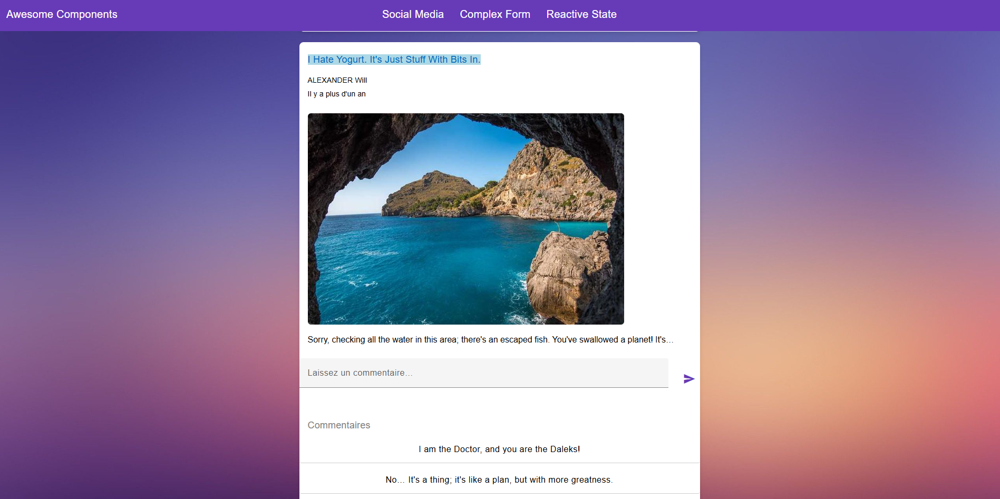
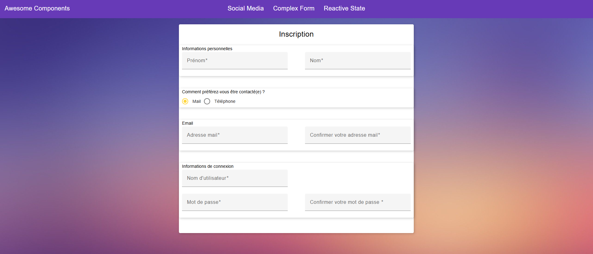
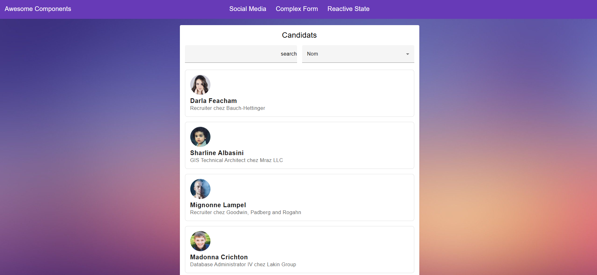
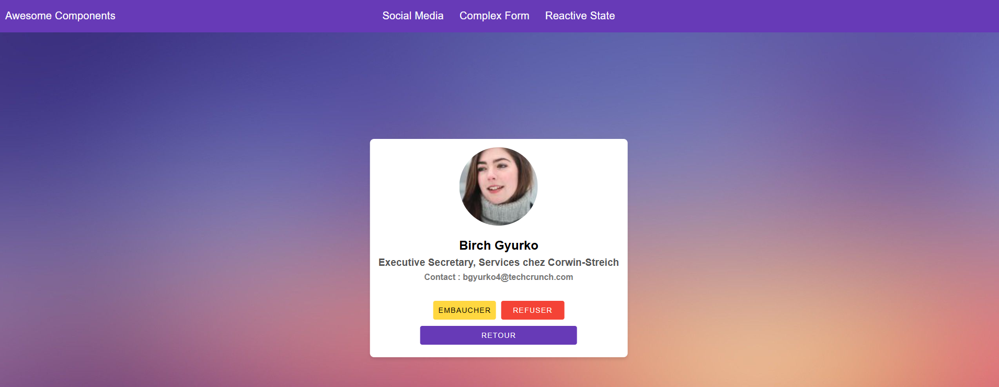

Mini Réseau Social avec Angular 🌐
📝 Description
Ce projet est une application web qui propose :

Un mini réseau social permettant aux utilisateurs d’enregistrer des photos et de rédiger des commentaires.
Un formulaire complexe d’inscription utilisateur intégrant :
Affichage conditionnel.
Comportements réactifs.
Validation personnalisée.
Un outil d’embauche destiné aux RH de l’entreprise SnapFace, offrant une gestion 100 % réactive des candidats.
Ce projet a été réalisé dans le cadre du cours "Perfectionnez-vous sur Angular" sur OpenClassrooms.

🛠️ Technologies utilisées

Framework : Angular
Langage : TypeScript
Gestionnaire de paquets : NPM
Stylisation : SCSS
📸 Aperçu de l'application

Page d’accueil
Une interface intuitive permettant de naviguer dans le mini réseau social, de publier des photos et d’interagir avec des commentaires.
Voir aperçu :

Formulaire complexe
Un formulaire avancé pour l’inscription utilisateur avec des fonctionnalités interactives et des validations dynamiques.
Voir aperçu :

Outil RH pour SnapFace
Une liste réactive des candidats pour simplifier le processus de recrutement avec un affichage détaillé pour chaque profil.
Voir aperçu :

